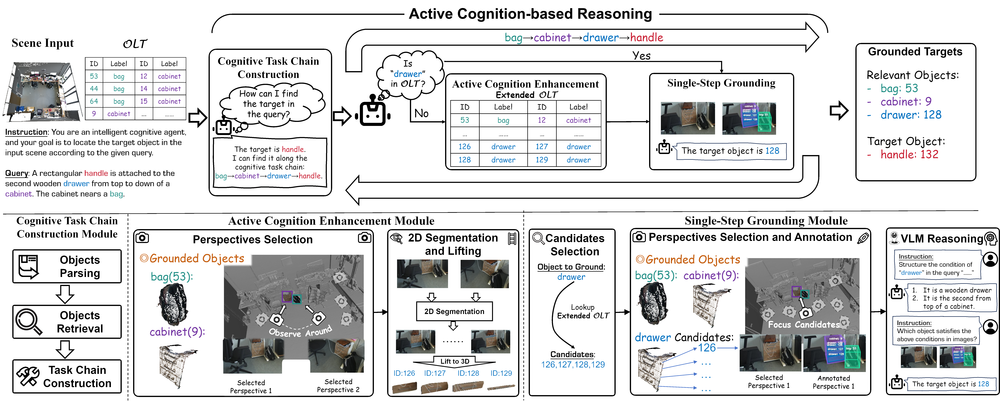

# OpenGround: Active Cognition-based Reasoning for Open-World 3D Visual Grounding

[Wenyuan Huang](https://why-102.github.io/)¹ [Zhao Wang](#)² [Zhou Wei](#)² [Ting Huang](#)¹ [Fang Zhao](#)¹ [Jian Yang](#)¹ [Zhenyu Zhang](https://jessezhang92.github.io/)¹✉️

[Project Page](https://why-102.github.io/openground.io/) | [Paper](https://arxiv.org/pdf/2512.23020) | [arXiv](https://arxiv.org/abs/2512.23020) | [Benchmark](https://huggingface.co/datasets/Inmny/OpenTarget)

¹Nanjing University, School of Intelligent Science and Technology  
²China Mobile Zijin Innovation Institute  
✉️Corresponding author

---

## Abstract

3D visual grounding aims to locate objects based on natural language descriptions in 3D scenes. Existing methods rely on a pre-defined Object Lookup Table (OLT) to query Visual Language Models (VLMs) for reasoning about object locations, which limits the applications in scenarios with undefined or unforeseen targets. To address this problem, we present **OpenGround**, a novel zero-shot framework for open-world 3D visual grounding. Central to OpenGround is the **Active Cognition-based Reasoning (ACR) module**, which is designed to overcome the fundamental limitation of pre-defined OLTs by progressively augmenting the cognitive scope of VLMs. The ACR module performs human-like perception of the target via a cognitive task chain and actively reasons about contextually relevant objects, thereby extending VLM cognition through a dynamically updated OLT. This allows OpenGround to function with both pre-defined and open-world categories. We also propose a new dataset named **OpenTarget**, which contains over 7000 object-description pairs to evaluate our method in open-world scenarios. Extensive experiments demonstrate that OpenGround achieves competitive performance on Nr3D, state-of-the-art on ScanRefer, and delivers a substantial 17.6% improvement on OpenTarget.

---

## 📝 Updates

- [x] **[25/12/28]** Introducing **OpenGround**, a new framework towards open-world 3D visual grounding. For more details, kindly refer to our Project Page and Preprint. 🚀
- [x] **[26/01/04]** The benchmark **OpenTarget** have been released. 🤗
- [ ] **[Coming soon]** The **code** have been released. 🤗

---

## Table of Contents

- [0. Framework Overview](#0-framework-overview)
- [1. Run](#1-run)
- [2. Results](#2-results)
- [3. Citation](#3-citation)

---

## 0. Framework Overview



Overview of the **OpenGround** framework. We propose the **Active Cognition-based Reasoning (ACR)** module that progressively enhances the cognition of VLMs. The ACR module builds a cognitive task chain to perform human-like cognitive planning on how to find the target, and then actively reasons about the location based on the contextually relevant objects to extend the VLMs' cognition via a dynamically updated OLT. This enables OpenGround to function effectively in both pre-defined and open-world scenarios without relying on a complete pre-defined OLT.

**Key Components:**

- **Active Cognition-based Reasoning (ACR)**: Performs human-like perception via cognitive task chains and actively reasons about contextually relevant objects
- **Dynamic Object Lookup Table (OLT)**: Continuously updated during the reasoning process to extend VLM cognition
- **OpenTarget Dataset**: New benchmark with over 7000 object-description pairs for open-world evaluation

---

## 1. Run

Coming soon... The original code has over 3000 lines in a single file. I will publish it once it's organized.

---

## 2. Results

### 2.1 Quantitative Results

**ScanRefer (Overall):**

| Method | Supervision | Acc@0.25 | Acc@0.5 |
|--------|-------------|----------|---------|
| SPAZER | Zero-Shot | 57.2 | 48.8 |
| SeqVLM | Zero-Shot | 55.6 | 49.6 |
| VLM-Grounder* | Zero-Shot | 48.3 | 33.5 |
| SeeGround | Zero-Shot | 44.1 | 39.4 |
| **OpenGround (Ours)** | Zero-Shot | **61.8** | **53.1** |

**Nr3D (Overall):**

| Method | Supervision | Overall |
|--------|-------------|---------|
| SPAZER† | Zero-Shot | 63.8 |
| SeqVLM | Zero-Shot | 53.2 |
| VLM-Grounder | Zero-Shot | 48.0 |
| SeeGround | Zero-Shot | 46.1 |
| ZSVG3D | Zero-Shot | 39.0 |
| **OpenGround (Ours)†** | Zero-Shot | **61.7** |

**OpenTarget (New Benchmark, GT OLT):**

| Method | OLT | Acc@0.25 | Acc@0.50 |
|--------|-----|----------|----------|
| VLM-Grounder* | GT | 28.6 | 20.4 |
| SeqVLM | GT | 19.4 | 19.2 |
| SeeGround | GT | 17.9 | 17.4 |
| GPT4Scene | GT | 12.1 | 11.8 |
| **OpenGround (Ours)** | GT | **54.8 (+27.0%)** | **54.3 (+33.9%)** |

> **Note:** * denotes results on selected samples. † denotes methods using GPT-4o as VLM.

### 2.2 Qualitative Results

See our [Project Page](https://why-102.github.io/openground.io/) for visual comparisons and interactive demos.

---

## 3. Citation

If you find our work and code repository helpful, please consider starring our repository and citing the following paper:

```bibtex
@misc{huang2025opengroundactivecognitionbasedreasoning,
      title={OpenGround: Active Cognition-based Reasoning for Open-World 3D Visual Grounding}, 
      author={Wenyuan Huang and Zhao Wang and Zhou Wei and Ting Huang and Fang Zhao and Jian Yang and Zhenyu Zhang},
      year={2025},
      eprint={2512.23020},
      archivePrefix={arXiv},
      primaryClass={cs.CV},
      url={https://arxiv.org/abs/2512.23020}, 
}
```

---

## Star History

[](https://star-history.com/#why-102/openground&Date)

---

<div align="center">

**If you find this project helpful, please consider giving us a star ⭐**

</div>
